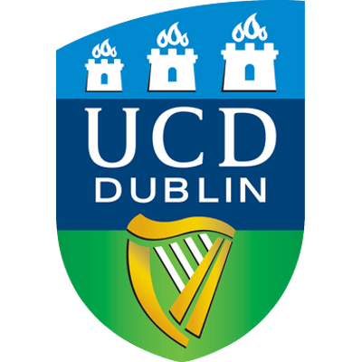

# About Me 👨‍💻
I'm Karol. I'm a third year Computer Science Student at University College Dublin and an aspiring Software Engineer! 
# Modules I'm taking this Semester 📚
## Autumn
- **(COMP30010)** - Foundations of Computing
- **(COMP30030)** - Introduction to Artificial Intelligence
- **(COMP30040)** - Networks and Internet Systems
- **(COMP30070)** - Object Oriented Programming
- **(COMP30080)** - Computer Systems
## Spring
- **(COMP30770)** - Programming for Big Data
- **(COMP30860)** - Web Development
- **(COMP30870)** - Graph Algorithms
- **(COMP30790)** / **(COMP30880)** - Industry Internship / Software Engineering Project 3
## Connect with me!

